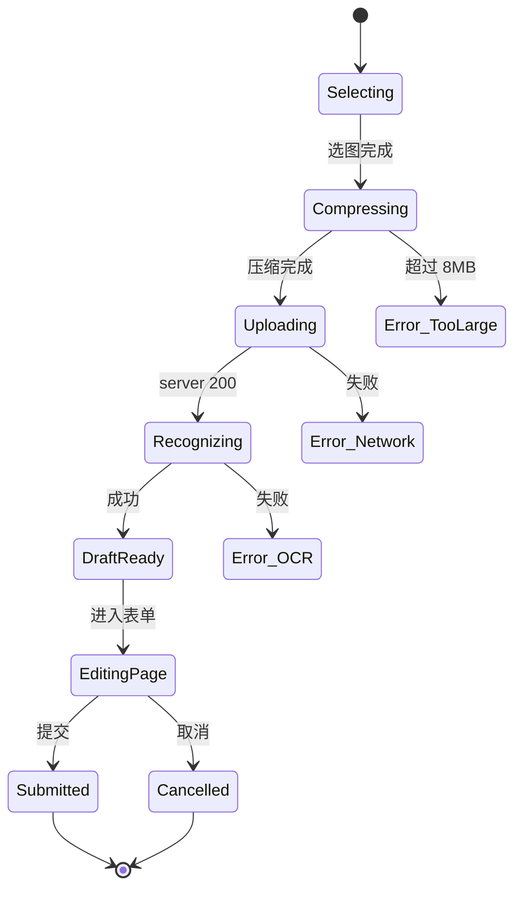

# AI 对话首页 · 前端设计规格 v0.1

> 适用：`v3-uniapp`，`pages/ai/index.vue` 重写。
> 范围：位置 / 10 个屏 / 全部组件 / 全部交互 / 全部样式 / 动效 / 错误态。
> 不依赖任何原型 HTML；本文是后续实施的唯一契约。

---

## 0 · 入口与全局坐标

### 0.1 入口

`pages.json` 中 tabBar midButton（当前叫 "AI"，本文后续文案改为「对话」）。

点击 midButton：`uni.switchTab({ url: '/pages/ai/index' })`。

切换到本页面后，tabBar 中 midButton 高亮态沿用现有 accent (`--c-accent`)。

### 0.2 全局尺寸

| 元素 | 值 | 备注 |
| --- | --- | --- |
| 视口宽 | 390 | iPhone 12 mini 标准 |
| 视口高 | 844 | 留刘海高度 |
| 安全区顶 | 36 | 状态栏（`notch` 容器） |
| 标题栏 | 44 | 居中标题 |
| 输入栏 | 56 | 含 padding 8 |
| tabBar | 78 | 含 64 控件 + 14 安全 |
| 主区 | 自适应 flex:1 | 在上述四块间填充 |

### 0.3 全局色板

直接读 `v3-uniapp/src/uni.scss` 中的 CSS 变量，禁止新增。

| 用途 | 变量 | 备注 |
| --- | --- | --- |
| 主背景 | `--c-paper` | 整个 page |
| 卡片背景 | `--c-paper-2` | 气泡 / 工具卡 / 输入框 |
| 主文字 | `--c-ink` | 标题 / 气泡正文 |
| 次文字 | `--c-steel` | meta / 描述 |
| 弱文字 | `--c-mute` | meta 时间 / 提示 |
| 强调 | `--c-accent` | 主按钮 / 链接 / 用户气泡底 |
| 警示 | `--c-warn` | 待补字段标识 |
| 警告 | `--c-danger` | 错误描边 |
| 成功 | `--c-ok` | 已提交回执 |
| 引用 / 知识库 | `--c-blue` | 出处卡左竖条 |
| 等宽字体 | `--ff-mono` | 所有编号、时间、按钮标签 |
| 中文字体 | `--ff-cn` / `--ff-display` | 标题用 display，正文 cn |
| 圆角 | `--r-md` 10 / `--r-pill` 999 | 卡片和气泡 |

---

## 1 · Screen 1 默认态（空会话开屏）

### 1.1 用途

进入页面且内存无消息时显示。给 6 个高频入口。

### 1.2 内容

- 标题「对话」（`titlebar.title`）。
- 右上模型指示器：「● 深度求索 R1」。圆点用 `--c-ok`。
- 主区：从上到下垂直堆叠：
  1. 欢迎卡（圆角 14，背景 `--c-paper-2`，1px `--c-line-soft` 描边）。
     - 顶部小写 mono 「ASK · AI HUB」。
     - 主标题「今天你想做点什么？」（`--ff-display` 22 700）。
     - 副标题「拍照建档 · 问业绩 · 搜文档 · 查跟进」（`--c-mute` 13）。
     - 6 张场景卡（双行 3 列网格，gap 10）。

### 1.3 6 张场景卡内容（按优先级排）

每张宽 110，gap 10；卡片垂直排列：

```
[📷 拍照建档]   [查业绩]      [补资质]
[问流程]        [搜文档]      [查跟进]
```

实际渲染用线条 SVG / 单字字符代替 emoji，避免 icon 库依赖：

| i | icon 字 | 标题 | 副文 | 色调 |
| - | --- | --- | --- | --- |
| 1 | 摄 | 拍照建档 | 上传图片直接建客户 | `--c-accent` |
| 2 | 钱 | 查业绩 | 按客户 / 时间聚合 | `--c-blue` |
| 3 | 补 | 补资质 | 缺照片单子一次性补 | `--c-warn` |
| 4 | 问 | 问流程 | OA / SOP / 报价规则 | `--c-green` |
| 5 | 搜 | 搜文档 | 合同 / 手册 / 制度 | `--c-steel` |
| 6 | 跟 | 查跟进 | 客户待办 / 上次沟通 | `--c-gold` |

### 1.4 样式

```
.welcome {
  margin: 14px 16px 0;
  padding: 16px;
  border-radius: 14px;
  background: var(--c-paper-2);
  border: 1px solid var(--c-line-soft);
}
.welcome .kicker {
  font-family: var(--ff-mono); font-size: 10px; color: var(--c-mute);
  letter-spacing: 0.16em; text-transform: uppercase;
}
.welcome h2 {
  font-family: var(--ff-display); font-size: 22px; font-weight: 700;
  letter-spacing: -0.01em; margin: 8px 0 6px; color: var(--c-ink);
}
.welcome .sub {
  font-size: 13px; color: var(--c-mute);
}
.scene-grid {
  display: grid; grid-template-columns: repeat(3, 1fr); gap: 10px; margin-top: 14px;
}
.scene-card {
  background: var(--c-paper); border: 1px solid var(--c-line-soft);
  border-radius: 10px; padding: 10px 8px;
  display: flex; flex-direction: column; gap: 4px;
}
.scene-card .glyph {
  width: 28px; height: 28px; border-radius: 6px;
  background: color-mix(in srgb, var(--card-tone) 12%, transparent);
  color: var(--card-tone); display: flex; align-items: center; justify-content: center;
  font-family: var(--ff-display); font-weight: 700;
}
.scene-card .t { font-family: var(--ff-cn); font-size: 12.5px; font-weight: 600; color: var(--c-ink); }
.scene-card .s { font-size: 10.5px; color: var(--c-mute); line-height: 1.35; }
```

### 1.5 交互

- 点击场景卡：将文案（如「拍照建档」）填入 composer 并 focus 输入框；用户回车发送即跳到「拍照」分支的预填状态。
- 长按场景卡：触发 `?show-debug` 调试面板（开发用）。

---

## 2 · Screen 2 输入栏状态机

### 2.1 六个状态

| id | 触发 | 表现 |
| --- | --- | --- |
| S0 idle | 进入或消息流清空 | + 按钮灰 + 输入框「告诉 AI 你想做点什么…」+ 发送灰 |
| S1 focus | 输入框被聚焦 | + 按钮转文字色 + 输入框显示光标 + 发送仍是灰 |
| S2 typing | 用户输入字符 | + 保持 + 输入框显示内容 + 发送实心 |
| S3 attachments | 用户选了附件 | 输入栏上方多一行 chip，每个 chip：缩略图 + 文件名 + × |
| S4 streaming | AI 正在思考 | 整行替换为「● ● ● AI 正在思考…」+ 「取消」链接按钮 |
| S5 error | 网络或 4xx 报错 | 输入栏上方红色横条：code + 中文 + 重试按钮 |

### 2.2 内容

- 占位文案矩阵：
  - 文字态：依据上一对话类型动态切换 hint（最近 3 条是图片则提示「继续发图片」；否则通用）。
  - 附件态：placeholder 改为「加一句话说明」。
- S4 取消按钮：`uni.showActionSheet` 选项「取消本次 / 保留草稿」。

### 2.3 样式

```
.composer { background: var(--c-paper); padding: 8px 12px; display: flex; gap: 8px; align-items: center; border-top: 1px solid var(--c-line-soft); }
.composer .add { width: 36px; height: 36px; border-radius: 50%; background: var(--c-paper-2); border: 1px solid var(--c-line); color: var(--c-mute); font-size: 16px; }
.composer .input {
  flex: 1; min-height: 36px; border-radius: 999px;
  background: var(--c-paper-2); border: 1px solid var(--c-line);
  padding: 8px 14px; font-size: 14px; color: var(--c-ink);
  display: flex; align-items: center;
}
.composer .send {
  width: 36px; height: 36px; border-radius: 50%;
  background: var(--c-mute); color: #fff; font-weight: 700;
  display: flex; align-items: center; justify-content: center;
}
.composer .send.active { background: var(--c-accent); }
.composer.streaming .input { background: var(--c-paper-2); border-color: var(--c-warn); color: var(--c-warn); }
.composer.error::before { content: ''; }
.composer .error-bar {
  margin: 6px 12px 0; padding: 8px 10px;
  background: #FAE8E6; color: var(--c-danger); font-size: 12.5px;
  border: 1px solid var(--c-danger); border-radius: 8px;
}
.attachment-row {
  display: flex; gap: 6px; overflow-x: auto; padding: 4px 12px;
  border-top: 1px solid var(--c-line-soft); background: var(--c-paper-2);
}
.attachment-row .chip {
  display: inline-flex; gap: 4px; align-items: center;
  padding: 4px 8px; background: var(--c-paper); border: 1px solid var(--c-line);
  border-radius: 999px; font-size: 11.5px; color: var(--c-ink);
}
```

### 2.4 交互

- + 按钮 → 关闭：点输入框收回面板。
- 回车键 → 发送。
- Shift + 回车 → 换行（多行可用时）。
- 长按 + 按钮 → 弹菜单「清空输入 / 加载最近草稿 / 关闭」。

---

## 3 · Screen 3 功能面板（+ 弹出）

### 3.1 内容

浮层 2 行 4 列网格，按钮 64×64：

```
[ 📷 拍照 ]   [ ▤ 上传 ]   [ ⌖ 模板 ]   [ ＋ 附件 ]
[ ¥ 业绩 ]   [ ◎ 客户 ]   [ ? 流程 ]   [ ✎ 文档 ]
```

实际 icon 用单字 / 几何符号：摄 / 上 / 模 / 附 / 钱 / 客 / 问 / 搜。

### 3.2 按钮文案

| id | icon | 标题 | 说明 | 行为 |
| --- | --- | --- | --- | --- |
| F1 | 摄 | 拍照 | 直接调相机 | `uni.chooseMedia` |
| F2 | 上 | 上传 | 从相册 / 文件 | `uni.chooseImage` / file picker |
| F3 | 模 | 模板 | 弹出模板列表 | 抽屉式弹层 |
| F4 | 附 | 附件 | 任意类型 | 同 F2 |
| F5 | 钱 | 查业绩 | 预填「请告诉我 XXX 的业绩」 | 直接发送 |
| F6 | 客 | 建客户 | 预填「帮我建一个新客户：…」 | focus 输入框 |
| F7 | 问 | 问流程 | 预填「流程上 XXX 怎么处理？」 | focus 输入框 |
| F8 | 搜 | 搜文档 | 预填 keyword | focus + 选文件 |

### 3.3 样式

```
.funcpanel {
  position: absolute; left: 0; right: 0; bottom: 64px;
  background: var(--c-paper-2); border-top: 1px solid var(--c-line);
  padding: 14px 12px;
  display: grid; grid-template-columns: repeat(4, 1fr); gap: 12px;
  transform: translateY(24px); opacity: 0; pointer-events: none;
  transition: transform .22s ease-out, opacity .22s ease-out;
}
.funcpanel.show { transform: translateY(0); opacity: 1; pointer-events: auto; }
.func-btn { display: flex; flex-direction: column; align-items: center; gap: 6px; }
.func-btn .glyph {
  width: 48px; height: 48px; border-radius: 12px;
  background: var(--c-paper); border: 1px solid var(--c-line-soft);
  color: var(--c-accent); display: flex; align-items: center; justify-content: center;
  font-family: var(--ff-display); font-weight: 700; font-size: 18px;
}
.func-btn .lbl { font-size: 11px; color: var(--c-ink); }
```

### 3.4 交互

- 关闭：
  - 点面板外
  - 点输入框
  - 发送一条消息后自动收起
- 拍照上传：成功后回到 S3 attachments。

---

## 4 · Screen 4 消息气泡体系

### 4.1 用户气泡

- 右对齐，宽 ≤ 78%。
- 背景 `--c-accent`，文字 #fff。
- meta 行 9px mono：`09:41 · 已发`。
- 多张图：3 列网格，超过 9 张收为 +N。

### 4.2 AI 气泡

- 左对齐，宽 ≤ 78%。
- 背景 `--c-paper-2`，1px `--c-line-soft` 描边。
- 左下角 4px 圆角（与背景区分）。
- meta 行：`09:41 · 来自 R1 · 9 个工具调用`。

### 4.3 系统气泡（识别中 / 工具调用中）

- 居中，宽度 60-80%。
- 背景 `--c-paper-2` + `--c-warn` 1px 描边。
- 内容：「● 正在识别…」 / 「● 调用 /orders…」。

### 4.4 流式占位

- 三点 + label：`正在生成 · 第 1 步（共 3 步）`。
- 不允许单帧超过 1500ms；超时切回非流式。

### 4.5 样式

```
.bubble {
  max-width: 78%; padding: 10px 12px; border-radius: 14px;
  font-size: 13.5px; line-height: 1.55; word-break: break-word;
  background: var(--c-paper-2); border: 1px solid var(--c-line-soft);
  position: relative;
}
.bubble.me { align-self: flex-end; background: var(--c-accent); color: #fff; border-bottom-right-radius: 4px; }
.bubble.ai { align-self: flex-start; border-bottom-left-radius: 4px; color: var(--c-ink); }
.bubble .meta { margin-top: 6px; font-size: 10px; font-family: var(--ff-mono); letter-spacing: 0.06em; color: var(--c-mute); }
.bubble.me .meta { color: rgba(255,255,255,0.7); }
.bubble.system { align-self: center; max-width: 70%; border-color: var(--c-warn); color: var(--c-warn); background: #FFF7E6; }
.bubble.tool { padding: 0; background: transparent; border: none; }
```

### 4.6 交互

- 双击 AI 气泡：复制全文。
- 长按 AI 气泡：「复制 / 转客服 / 折叠相同工具调用」。
- 长按用户气泡：「撤回」（仅在 60s 内有效）。

---

## 5 · Screen 5 工具卡渲染规范

AI 气泡中可以嵌入多种工具卡。

### 5.1 共通样式

```
.tool-card {
  margin-top: 8px; padding: 12px; border-radius: 12px;
  background: var(--c-paper); border: 1px solid var(--c-line-soft);
  border-left-width: 3px; border-left-color: var(--tone, var(--c-accent));
  display: flex; flex-direction: column; gap: 8px;
}
.tool-card .head {
  font-family: var(--ff-mono); font-size: 10px; color: var(--c-mute);
  letter-spacing: 0.08em; text-transform: uppercase;
}
.tool-card .body { font-size: 13px; color: var(--c-ink); line-height: 1.55; }
.tool-card .cta { display: flex; gap: 8px; }
.tool-card .btn {
  flex: 1; padding: 10px; border-radius: 10px;
  background: var(--c-paper-2); color: var(--c-accent);
  border: 1px solid var(--c-accent); text-align: center; font-size: 13px; font-weight: 600;
}
.tool-card .btn.solid { background: var(--c-accent); color: #fff; }
.tool-card.warn { border-left-color: var(--c-warn); }
.tool-card.ok { border-left-color: var(--c-ok); }
```

### 5.2 识别结果卡

- 标题「识别结果 · IMG_0741.jpg」。
- 字段列表：每行 key:value，warn 字段加 ⚠️。
- 底部按钮：「进入客商编辑态 ›」「再来一张」。

### 5.3 客商草稿卡

- 标题「草稿 · DRAFT-CUST-20260725-003」。
- 主字段：客户名称（大字）。
- meta：行业 / 信用 / 资质状态。
- 按钮：「进入编辑态 ›」。

### 5.4 KPI 卡

- 最多 3 列 grid；每列：label（10px mono 强调）+ value（22px display）+ delta（10px mono）。
- 数字自动用 `formatCents`。

### 5.5 列表气泡

- 标题「3 单可继续推」。
- 每行：单号（mono）+ 状态（带颜色圆点）；点击跳 detail。

### 5.6 引用卡（知识库出处）

- 标题「《文档名 · §2.3》」。
- 正文 ≤ 200 字。
- 按钮：「查看原文 ›」「相关业务单 ›」。

### 5.7 历史相似案例

- 标题「相似案例 · 1 / 3」。
- 单号 + 时间 + 1 行原因。

### 5.8 提交回执

- 状态「成功 / 失败」。
- 单号（mono）。
- 时间。

### 5.9 操作按钮组

- 不超过 2 个主按钮（兄弟按钮）。
- 危险操作（删除提交）必须二次确认。

---

## 6 · Screen 6 拍照识别完整流程

### 6.1 触发

1. 点 + → 拍照。
2. 用户输入触发词（识别 reply）。

### 6.2 步骤

| 步 | 用户可见 | 内部状态 |
| --- | --- | --- |
| 1 | 拍照 / 选图 | 本地压缩 1080 长边 |
| 2 | 上传进度条 | `POST /storage/upload` |
| 3 | 「● 已上传 · 正在识别」系统气泡 | 调多模态 |
| 4 | AI 气泡显示识别结果（识别结果卡） | tool_call: `customer_qualification` |
| 5 | 用户点击「进入客商编辑态」 | `navigateTo` 加 `?prefill=...` |
| 6 | 编辑页（如 `pages/customer-new/index`） | 表单读取 `prefill`，缺字段高亮 |
| 7 | 用户在表单页补字段 + 提交 | 跳既有 `POST /biz/:kind` |
| 8 | 返回对话页看到回执卡 | 状态机闭合 |

### 6.3 状态机



### 6.4 样式要点

- 进度气泡：横向进度条 4px 高、accent 色。
- 错误气泡：danger 1px 边框 + 「重试」按钮。

---

## 7 · Screen 7 数据查询

### 7.1 触发

- 用户输入「查业绩 · 上海建工」 / 快捷按钮 / 「业绩」场景卡。

### 7.2 输出

第一段 AI 文字简短摘要（≤80 字）；下文接 1 张 KPI 卡 + 1 张列表气泡。

### 7.3 KPI 卡字段

| key | label | 示例 | tone |
| --- | --- | --- | --- |
| gmv | GMV | `¥ 482,610` | `--c-ink` |
| orderCount | 订单数 | `12` | `--c-steel` |
| pending | 待处理 | `¥ 86,400` | `--c-warn` |

### 7.4 列表气泡字段

每行：
- 单号（mono 11）。
- 客户（cn 12.5 600）。
- 状态（chip · tone）。
- 金额（`formatCents`，右对齐）。

### 7.5 交互

- 点行：跳 `/pages/order-detail/index?no=...`。
- 点 KPI 卡任意数字：跳 `/pages/orders/index?filter=...`。
- 点「起邮件草稿」按钮：在 composer 中预填草稿。

---

## 8 · Screen 8 知识库问答

### 8.1 触发

- 自然语言提问（不带附件）。

### 8.2 输出

第一段：短答（2-3 行）。
第二段：1-2 张「来源出处卡」。
第三段：1 张「相似案例」气泡。

### 8.3 来源出处卡样式

```
.kb-card {
  border-left: 3px solid var(--c-blue);
  padding: 10px 12px;
  background: var(--c-paper);
}
.kb-card .doc {
  font-family: var(--ff-mono); font-size: 10px; color: var(--c-mute);
  letter-spacing: 0.06em;
}
.kb-card .title { font-family: var(--ff-display); font-size: 13.5px; font-weight: 600; color: var(--c-ink); margin-top: 4px; }
.kb-card .body { font-size: 12.5px; color: var(--c-ink); line-height: 1.55; margin-top: 6px; }
.kb-card .row { display: flex; gap: 8px; margin-top: 8px; }
.kb-card .link { font-size: 12px; color: var(--c-accent); }
```

### 8.4 相似案例气泡

紧接出处之后，标题「相似案例 · 1 / 3」，每条：单号 + 时间 + 1 行原因 + 「查看业务单 ›」按钮。

### 8.5 交互

- 展开出处：长按出处卡 → 切到「参考详情」视图（无路由跳转，弹层）。
- 追问：用户在 composer 继续输入；后端允许最近 5 条作为轻上下文。

---

## 9 · Screen 9 会话抽屉（轻量占位）

### 9.1 内容

| 区块 | 说明 |
| --- | --- |
| 头部 | 标题「会话」+ 「＋ 新会话」按钮 |
| 今天 | 默认折叠（仅显示 1 条），展开后列表 |
| 昨天 | 同上 |
| 本周 | 同上 |
| 更早 | 同上 |
| 固定 · 收藏 | 长按出现的固定项 |

### 9.2 卡片字段

- 标题：会话首句（≤30 字）
- meta：时间（`HH:mm` 或 `MM-dd`）+ token 数（如 `156 token`）

### 9.3 样式

```
.drawer { position: absolute; inset: 0; display: flex; background: rgba(0,0,0,0.4); }
.drawer .panel { width: 84%; background: var(--c-paper); padding: 18px 16px; display: flex; flex-direction: column; gap: 12px; }
.drawer h4 { font-family: var(--ff-display); font-size: 16px; margin: 0; }
.pill-group { font-family: var(--ff-mono); font-size: 10px; color: var(--c-mute); letter-spacing: 0.08em; }
.conv-card {
  background: var(--c-paper-2); border: 1px solid var(--c-line-soft);
  border-radius: 10px; padding: 10px 12px;
}
.conv-card .t { font-family: var(--ff-cn); font-size: 13px; font-weight: 600; }
.conv-card .m { font-size: 11px; color: var(--c-mute); margin-top: 2px; }
.conv-card.pinned { border-color: var(--c-accent); }
```

### 9.4 阶段一约束

- 阶段一只放 UI 框架，数据来自 `useChatStore` 内存。
- 「＋ 新会话」等同清空 store，不持久化。
- 长按菜单：重命名 / 固定 / 删除 / 清空全部，UI 上完整支持。

---

## 10 · Screen 10 lightbox（场景卡浮层）

### 10.1 触发

- 点击欢迎卡中的任一场景卡 → 弹出 lightbox 展示该场景示意图。

### 10.2 用途

向用户展示"AI 能做什么"的实景，用静态图代替真实系统截图（设计 / 演示阶段）。

### 10.3 内容

- 居中放图，最大 360×620。
- 右侧描述：标题 + 触发词 + 1 句说明 + 关键提示 3-5 条 + 「开始」CTA。
- 底部：「ESC 关闭」。

### 10.4 样式

```
.lightbox { position: fixed; inset: 0; background: rgba(0,0,0,0.85); display: flex; align-items: center; justify-content: center; padding: 24px; }
.lightbox .holder { display: flex; gap: 24px; max-width: 90vw; }
.lightbox .info { width: 240px; color: #E6E1D6; display: flex; flex-direction: column; gap: 10px; }
.lightbox .info h3 { font-family: var(--ff-display); font-size: 18px; color: #fff; margin: 0; }
.lightbox .preview {
  width: 360px; height: 720px; background: var(--c-paper);
  border-radius: 24px; padding: 16px; overflow: hidden;
}
```

---

## 11 · Screen 11 错误态集合

### 11.1 网络错误

- 表现：红色横条 `网络连接失败 · 重试 ›`。
- 触发：`uni.request` 失败或超时。

### 11.2 401 / 403 / 5xx

- 401：已接入 `setAuthNotifier`，reLaunch 至 `/pages/login/index`。
- 403：AI 气泡：「当前账号无权使用 AI Hub。」
- 5xx：AI 气泡显示 server msg + 「重新发起」。

### 11.3 附件上传失败

- 单条 chip 变红，hover 提示「重传 / 删除」。

### 11.4 业务错误

| code | 处理 |
| --- | --- |
| 10009 | 版本不一致，刷新后重试 |
| 10404 | 资源不存在，给「重新拍照 / 重新选择」 |
| 20100 / 20104 | 已跳登录页 |
| 其他 5xxxx | AI 气泡以红边显示服务端 msg |

---

## 12 · Screen 12 动效细则

| id | 元素 | 动画 |
| --- | --- | --- |
| A1 | 用户气泡入场 | translateY(8)→0, opacity 0→1, 150ms ease-out |
| A2 | AI 气泡入场 | translateY(8)→0, opacity 0→1, 180ms ease-out |
| A3 | 工具卡入场 | translateY(12)→0, opacity 0→1, 180ms ease-out |
| A4 | 功能面板 | translateY(24)→0, opacity 0→1, 220ms ease-out |
| A5 | 流式三点 | opacity .3 ↔ 1, 1.0s linear infinite（带 0.15s 错位） |
| A6 | 抽屉 | translateX(-100%)→0, opacity 0→1, 240ms ease-out |
| A7 | 跳业务页 | `uni.navigateTo` 沿用 uni-app 默认 |
| A8 | 返回对话 | 反向 reverse 220ms |
| A9 | 提交回执 | 自动追加，5s 后淡出 |

---

## 13 · 组件清单（前端实现时拆分）

| 组件 | 路径 | 职责 |
| --- | --- | --- |
| `ChatMessage.vue` | `components/ChatMessage/index.vue` | 单条消息的渲染入口（user / ai / system / tool） |
| `ChatBubble.vue` | `components/ChatMessage/ChatBubble.vue` | 气泡壳 + 文本 |
| `ToolCard.vue` | `components/ChatMessage/ToolCard.vue` | 工具卡壳 |
| `ToolRecog.vue` | `components/ChatMessage/ToolRecog.vue` | 识别结果 |
| `ToolDraft.vue` | `components/ChatMessage/ToolDraft.vue` | 草稿卡 |
| `ToolKpi.vue` | `components/ChatMessage/ToolKpi.vue` | KPI |
| `ToolList.vue` | `components/ChatMessage/ToolList.vue` | 列表气泡 |
| `ToolKb.vue` | `components/ChatMessage/ToolKb.vue` | 知识库出处 + 相似案例 |
| `ToolReceipt.vue` | `components/ChatMessage/ToolReceipt.vue` | 提交回执 |
| `Composer.vue` | `components/ChatComposer/index.vue` | 输入栏 6 态机 |
| `FuncPanel.vue` | `components/ChatComposer/FuncPanel.vue` | 功能面板 |
| `SessionDrawer.vue` | `components/SessionDrawer/index.vue` | 抽屉 |
| `SceneGrid.vue` | `components/SceneGrid/index.vue` | 默认态 6 张场景卡 |
| `KbTab.vue` | `components/KbTab/index.vue` | 知识库附件选择器 |
| `composables/useChat.ts` | `composables/useChat.ts` | 轻量 memory + 路由决策 |
| `composables/useAIRouter.ts` | `composables/useAIRouter.ts` | AI 回复 → Vue 组件映射 |

---

## 14 · 数据契约（与上文各组件一一对应）

详见本文 §6 / §7 / §8 给出的 TypeScript 形状；后端若引入 zod，再由 OpenAPI 生成同名类型。

---

## 15 · 实施拆分

| 阶段 | 范围 | 估时 |
| --- | --- | --- |
| 一 | `pages/ai/index.vue` + 上面 13 个组件 + 轻量 memory + 拍照识别 → 草稿闭环 | 1 周 |
| 二 | DB 持久化 + 抽屉数据可点开 + 跟进助手 | 1 周 |
| 三 | 会话绑业务单 + 群组总结 + Refine 报表 | 1 周 |

阶段一不新增后端端点；阶段二不动后端表。

---

## 16 · 验收清单（页级）

- [ ] 默认态渲染 6 张场景卡且点击能跳转对应 composer 模式
- [ ] composer 6 个状态机切换全部通过
- [ ] 功能面板 8 个按钮均能触发对应行为
- [ ] 用户 / AI / 系统 / 流式 占位 4 类气泡全部正确渲染
- [ ] 拍照识别闭环：拍照 → 上传 → 识别 → 进入表单 → 提交 → 回执
- [ ] 数据查询闭环：自然语言 → KPI 卡 → 列表 → 跳详情
- [ ] 知识库闭环：问 → 短答 → 出处 → 相似案例
- [ ] 11 个错误态分别对得上 §11 错误表
- [ ] 9 个动效在 H5 / mp-weixin / mp-alipay 上一致
- [ ] 全程不引入新色板 / 新字体

---