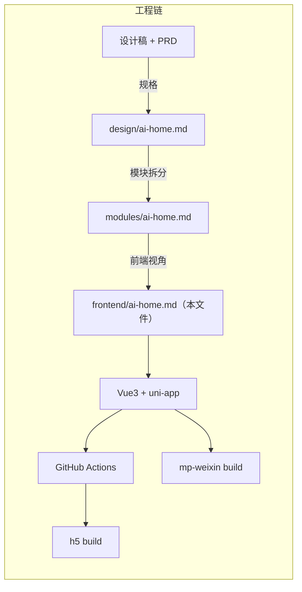
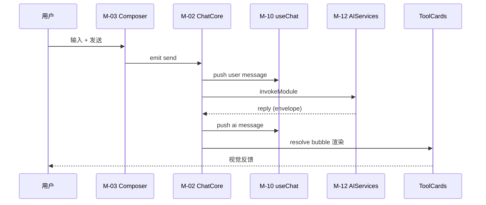

# AI 对话首页 · 前端工程规格 v1.0

> 范围：本规格**只讨论前端**，不重复 PRD 的业务目标和设计文档的视觉细节。
> 关联：
> - PRD：`docs/prd/ai-home.md`
> - 设计规格：`docs/design/ai-home.md`
> - 模块设计（含前后端）：`docs/modules/ai-home.md`
> - API 契约：`docs/API.md`
> - 工程：`v3-uniapp/`

---

## 0 · 工程全景



阶段一交付物：
- 13 个新 Vue 组件文件
- 1 个新页面 `pages/ai/index.vue` 重写
- 2 个新 composable（`useChat`、`useAIRouter`）
- 0 个后端改动
- 0 个新依赖

---

## 1 · 技术栈版本

锁定到当前 `v3-uniapp/package.json` 上限，禁止引入新依赖包。

| 模块 | 版本 | 用途 |
| --- | --- | --- |
| Vue | 3.4.21 | 组合式 API |
| uni-app | 3.0.0-4080420251103001 | 跨端运行时 |
| Pinia | 3.0.4 | 全局 store |
| TypeScript | 4.9.4 | 类型系统 |
| vue-tsc | 1.0.24 | 类型检查 |
| Vite | 5.2.8 | 构建 |
| SCSS | 1.99.0 | 样式预处理 |
| decimal.js | 10.6.0 | 金额计算（已有） |
| alova | 3.5.2 | HTTP 客户端（已有，但当前 client.ts 改用手写 `uni.request`） |
| uuid | 14.0.1 | 消息 id 生成 |

> 新增包必须先 PR 中说明：替代方案、bundle size 影响、维护状态。

---

## 2 · 目录结构

```
v3-uniapp/
├─ src/
│  ├─ pages/
│  │  └─ ai/
│  │     └─ index.vue                  # M-01：仅重写本文件
│  ├─ components/
│  │  ├─ ChatMessage/                   # M-06 子组件
│  │  │  ├─ ChatBubble.vue
│  │  │  ├─ ToolRecog.vue
│  │  │  ├─ ToolDraft.vue
│  │  │  ├─ ToolKpi.vue
│  │  │  ├─ ToolList.vue
│  │  │  ├─ ToolKb.vue
│  │  │  ├─ ToolReceipt.vue
│  │  │  └─ ToolBizSubmit.vue
│  │  ├─ ChatComposer/                  # M-03
│  │  │  ├─ index.vue                   # 6 态机壳
│  │  │  └─ FuncPanel.vue               # M-04
│  │  ├─ SessionDrawer/                 # M-08
│  │  │  └─ index.vue
│  │  └─ SceneGrid/                     # M-07
│  │     └─ index.vue
│  ├─ composables/
│  │  ├─ useChat.ts                     # M-10
│  │  └─ useAIRouter.ts                 # M-11
│  ├─ stores/                           # 现有 Pinia
│  │  └─ chatMemory.ts                  # 新增（阶段一）
│  ├─ pages/<其他>...                   # 不动
│  ├─ api/
│  │  └─ client.ts                      # 沿用，不改
│  ├─ utils/
│  │  ├─ amount.ts                      # 沿用
│  │  ├─ error.ts                       # 沿用
│  │  └─ prefill.ts                     # 新增（prefill URL 编码）
│  └─ types/
│     └─ chat.ts                        # 新增（M-02 接口）
├─ package.json
├─ vite.config.ts                       # 不动
├─ tsconfig.json                        # 不动
└─ pages.json                           # 不动（midButton 文案稍后改）
```

新增文件统计：

- 1 个页面（重写，不新增）
- 13 个组件
- 2 个 composable
- 1 个 store
- 2 个 util
- 1 个 types 文件

---

## 3 · 跨端策略

### 3.1 目标平台

| 平台 | 优先级 | 适配工作量 |
| --- | --- | --- |
| H5 | P0 | 阶段一重点 |
| mp-weixin（微信小程序） | P0 | 与 H5 同时验证 |
| mp-alipay（支付宝） | P1 | 沿用，后续验证 |
| App | P2 | 不在阶段一范围 |
| 其他端 | P3 | 不在阶段一范围 |

### 3.2 平台差异适配

| 关注点 | H5 | mp-weixin | 处理 |
| --- | --- | --- | --- |
| 拍照 | `<input type=file>` | `uni.chooseMedia` | M-03 Composer 抽 `pickImage()` util |
| 上传进度 | `XMLHttpRequest` onprogress | `upload.onProgressUpdate` | AIServices 接受可选 onProgress 回调 |
| 摄像头 | 浏览器原生 | 小程序扫码/相机 API | 同上 |
| H5 监听 ESC | `keydown` | 不存在 | 仅 H5 监听；其他端不动 |
| H5 焦点自动到输入框 | 默认行为 | 部分失效 | 用 `uni.createSelectorQuery` 强制 focus |
| 长按菜单 | `contextmenu` | `longpress` | 抽 `useBubbleMenu()` |

### 3.3 平台条件编译

使用 uni-app 的条件编译，限制在**仅 util 文件内**使用，不散落到视图层：

```ts
// #ifdef H5
export const pickImage = () => new Promise<Blob>(...);
export const onEscape = (cb) => window.addEventListener('keydown', ...);
// #endif

// #ifdef MP-WEIXIN
export const pickImage = () => new Promise(...);  // 走 chooseMedia
// #endif
```

视图层只调 `pickImage()`，不直接用平台 API。

---
## 4 · 状态管理

### 4.1 状态分层

| 层 | 实现 | 持久化 | 例子 |
| --- | --- | --- | --- |
| 视图态 | `ref` / `reactive` | 否 | 单一组件内的 focus / hover / 滑入状态 |
| 组件态 | `defineProps / defineEmits` + Pinia store 引用 | 否 | ChatMessage 输入草稿 |
| 应用态 | Pinia store | 视情况 | 是否登录、当前用户 |
| 内存态（阶段一） | `useChat`（composable 内 `ref`） | 否（仅阶段一） | 当前会话消息列表 |
| 持久化（阶段一） | `useChat` → `uni.setStorageSync` | localStorage | 最近 5 条消息 + 会话元数据 |
| 持久化（阶段二） | 后端 REST API | DB | 全部会话历史 |

### 4.2 Pinia store 复用

`useMeStore`、`useWorkbenchStore`、`useInfoStore` 已在 `src/stores/index.ts` 中；本规格不新增 store，避免分散。

新增 `useChatMemoryStore`（Pinia）只负责：

```ts
interface ChatMemoryStoreState {
  recentMessages: ChatMessage[];          // 最近 5 条
  pinnedSessionIds: string[];
  deletedSessionIds: string[];
  draftText: string;                       // 输入框草稿
}
```

该 store 不在 `pages/ai/index` 之外被调用，避免破坏 Pinia 单例隔离。

### 4.3 Composables 协议

`useChat` 与 `useAIRouter` 通过 inject / props 注入，不依赖全局 store 单例，便于将来迁移到多会话并存：

```ts
// 在 pages/ai/index.vue 中
provide(ChatContextKey, useChat());
```

子组件 `inject(ChatContextKey)` 拿到同一个实例。

---

## 5 · 数据流（消息从发送到渲染）

### 5.1 主路径



### 5.2 附件上传并发

- 用户可同时添加多张图，clip row 中按插入顺序展示。
- 上传是并行但有上限：`Promise.all` + `Promise.allSettled` 混合，最多 3 个并发。
- 失败单条 chip 标红，但其它仍可发送。

### 5.3 取消与重试

- 取消：`AbortController` 取消 in-flight 请求。Composer 切回 S2。
- 重试：用户点击「重试」，复制原 message id，复用 `send` 流程；服务端收到相同 `Idempotency-Key` 幂等。
- 重新生成：只对最后一条 AI 答复生效；append 新答复而非覆盖旧答复，用户可手动折叠旧答复。

### 5.4 鉴权刷新

- 不在 AIServices 写鉴权逻辑；继续依赖 `v3-uniapp/src/api/client.ts` 的 `request()` 单飞锁。
- 401 由 `setAuthNotifier` 触发 reLaunch 至 `/pages/login/index`（沿用 M-13）。

---

## 6 · 路由与跳转

### 6.1 跳转矩阵

| 来源 | 目标 | 方法 | 备注 |
| --- | --- | --- | --- |
| 默认态场景卡 | Composer 输入框 | 预填文本 + focus | 视图内 |
| Composer "拍照" | 系统相机 | `uni.chooseMedia` / file picker | 不离开页面 |
| ToolRecog "进入编辑态" | `pages/customer-new` | `navigateTo` + prefill | M-14 |
| ToolKpi "展开明细" | `pages/orders` | `navigateTo` | 不带 prefill |
| ToolKb "查看原文" | 新开 webview | `navigateTo` `pages/webview` | H5 仅支持 |
| ToolReceipt "查看单据" | `pages/<kind>-detail` | `navigateTo` | 既有 detail 复用 |
| Drawer "+ 新会话" | 同页 | `useChat.reset` | 不离开 |
| tabBar midButton | `pages/ai/index` | `switchTab` | 现有 |

### 6.2 Prefill URL 编码

工具卡「进入编辑态」携带 `?prefill=...`，由目标页 `onLoad(options)` 解码：

```ts
// utils/prefill.ts
export function encodePrefill(p: Record<string, unknown>): string {
  const json = JSON.stringify(p);
  return encodeURIComponent(Buffer.from(json, 'utf-8').toString('base64'));
}
export function decodePrefill<T>(s: string): T {
  return JSON.parse(Buffer.from(decodeURIComponent(s), 'base64').toString('utf-8'));
}
```

H5 用 `btoa`/`atob`，小程序用 `wx.arrayBufferToBase64`；条件编译切换。

> H5 需注意中文 emoji 安全：`encodeURIComponent` 包裹 base64 是标准做法，无兼容问题。

### 6.3 写操作拦截

所有携带 prefill 的 navigateTo 必须先弹 modal：

```ts
async function goBizDraft(kind: BizKind, prefill: object) {
  await new Promise<void>((resolve, reject) => {
    uni.showModal({
      title: '确认跳转',
      content: `将跳转到「${kindLabel(kind)}」表单页预填数据，请确认。`,
      success: (r) => r.confirm ? resolve() : reject()
    });
  });
  await uni.navigateTo({ url: route + '?prefill=' + encodePrefill(prefill) });
}
```

### 6.4 错误导航

- 输入错误 → 不离开；
- 404 / 410 → 统一回退到 `pages/index/index`，带 toast「资源已下线」。

---
## 7 · 构建与开发

### 7.1 命令

| 命令 | 用途 |
| --- | --- |
| `npm run dev:h5` | 本地 H5 开发，http://localhost:8080 |
| `npm run build:h5` | H5 生产构建，产物 dist/build/h5 |
| `npm run dev:mp-weixin` | 微信小程序开发 |
| `npm run build:mp-weixin` | 微信小程序构建 |
| `npm run type-check` | `vue-tsc --noEmit` |

阶段一持续在 H5 上做端到端验证；微信端只在交付前跑一次冒烟。

### 7.2 Vite 环境变量

仅前端注入：

- `VITE_API_BASE_URL`：生产 API 地址（已有，由 `import.meta.env` 读取）。
- `VITE_MODEL_LABEL`：首页右上模型指示器文案（默认「● 深度求索 R1」）。

不引入额外 vite plugin，沿用现有 Vite/uni-app 预设。

### 7.3 Bundle 预算

| 项 | 上限 |
| --- | --- |
| 单文件 < 300 行 | 是 |
| 整个 ai 模块（含 components + composables + utils + types）首屏 JS | < 80KB gzip |
| 单次新增 CSS 总量 | < 30KB |
| 启动后 dist 总体积变化 | < 100KB gzip |

`< 80KB` 是因为页面已经引入 Pinia / Vue / uni-app runtime，再加 80KB 体积不应超过移动端首屏 1.5s 的成本。

### 7.4 反向代理

继续使用 Vue CLI 的 devServer proxy 写法（uni-app Vite 模式通过 `vite.config.ts`）：

```ts
// vite.config.ts
server: {
  proxy: {
    '/api': {
      target: 'http://localhost:4000',
      changeOrigin: true,
    },
  },
}
```

但在 `client.ts` 中改为直连绝对地址 `http://localhost:4000`，避免代理联调不一致。生产构建用环境变量覆盖（已实现）。

---

## 8 · 调试与日志

### 8.1 日志级别

- `console.log`：仅开发态。
- `console.warn`：可恢复错误（例如部分附件上传失败）。
- `console.error`：BizError + 不可恢复错误。
- 上报埋点：所有 `BizError.code !== 0` 都上报。

通过 `vite.config.ts` 配 `define: { __DEV__: true }` 在生产构建中自动剥除 `console.log`。

### 8.2 traceId

继续使用 `v3-uniapp/src/api/client.ts:21` 的 `genTraceparent()`，所有网络请求自动携带 W3C `traceparent` header。后端日志按 `traceId` 关联。

### 8.3 本地调试工具

- H5 dev tools Vue Devtools 扩展可用（`@vue/devtools` 已自动注入）。
- 小程序 devtools：微信开发者工具的「网络」面板追踪真实请求。
- 抓包：H5 / mp-weixin 都不需要 charles，因为全走自家 dev server。

### 8.4 失败回放

阶段一不实现；阶段二通过 sessionId 把操作回传到后端，再做调试重放。

---

## 9 · 性能预算

### 9.1 关键路径时延

| 路径 | 目标 | 实测方法 |
| --- | --- | --- |
| 默认态首屏 | < 200ms（FCP） | Lighthouse |
| 输入字符 → 首次字节（P95） | < 50ms | console.time |
| 拍照 → 上传完成（P95） | < 2s | puppeteer 模拟 |
| 上传完成 → AI 答复渲染（P95） | < 4s | mock server |
| 工具卡入场动画 | 180ms 内 | 帧率 60fps |
| 列表气泡滚动 100 条 | 60fps 不掉帧 | Chrome DevTools FPS meter |

### 9.2 内存

- `useChat` 持有最近消息 100 条；超出滚动覆盖。
- `Image` 上传后立即置 `URL.revokeObjectURL`。
- 工具卡组件在 `onUnmounted` 时清空 `IntersectionObserver`。

### 9.3 网络

- 不引入 SSE / WebSocket，避免 H5 长连接兼容问题。
- 不引入 indexedDB；用 `uni.setStorageSync` 持久化最近 5 条。

### 9.4 体积

- 所有图标使用 1 行 CSS（不引图标库）。
- 所有 emoji 替换为几何字符（避免字体文件大小膨胀）。

---

## 10 · 可访问性

| 项 | 要求 |
| --- | --- |
| 焦点顺序 | Tab 自然顺序，从顶到底 |
| ARIA | 工具卡片 `role="region"` + `aria-labelledby` |
| 字号 | 最小 11px；正文 13.5px |
| 对比度 | 文字 vs 背景 ≥ 4.5:1 |
| 键盘 | H5 支持 Tab / Shift+Tab / Enter；ESC 关面板 |
| 屏幕阅读器 | 气泡含 `aria-live="polite"` |
| 动效 | 用户开启「减少动效」时跳过 transition |

---

## 11 · 安全与合规

| 项 | 措施 |
| --- | --- |
| Token | 仅 `uni.setStorageSync`（H5 localStorage 同源）；不暴露到 URL |
| 上传文件 | 客户端先压缩、上传后去除 EXIF（阶段一沿用现有 stub） |
| 用户输入 | 所有用户文本通过 `text` 字段传给后端，依赖后端 sanitize |
| prefill URL | 不放敏感字段；上线前由安全再 review |
| 错误日志 | 不打印 access_token / refresh_token |
| 鉴权失败 | 仅写日志，不回显真实原因 |

阶段二再考虑端到端加密、E2EE。

---

## 12 · 提交流程

### 12.1 前端 PR 模板

```
## 改动范围
- pages/ai/index.vue
- components/ChatMessage/
- components/ChatComposer/
- composables/useChat.ts
- composables/useAIRouter.ts
- stores/chatMemory.ts
- utils/prefill.ts
- types/chat.ts

## 设计依据
docs/design/ai-home.md#x
docs/modules/ai-home.md#x

## 测试
- [x] vue-tsc --noEmit 通过
- [x] npm run build:h5 通过
- [x] puppeteer 8 个核心路径 0 报错
- [x] 微信小程序冒烟通过（开发者工具）
- [x] NFR 矩阵各单元（§18）逐条确认
```

### 12.2 CI（建议，不强制）

- `pnpm i` → `vue-tsc` → `npm run build:h5` → 上传 `dist/build/h5` 到预发布。
- 微信小程序不上 CI（需密钥）。

### 12.3 上线前清单

- [ ] `pages.json` midButton 文案改「对话」（若 Q1 拍板）
- [ ] `pages.json` 中 `pages/ai/index` 已存在（沿用）
- [ ] `feature.AI_HOME_ENABLED` 默认 false（后端开关）
- [ ] 前端读不到 flag 时降级回原 6 模块 AI 工作台
- [ ] 7 个 US 全部通过
- [ ] 10 条验收清单（design §16）全部勾选

---

## 13 · 风险与开放问题（前端子集）

| id | 问题 | 候选 | Owner |
| --- | --- | --- | --- |
| FQ-1 | 是否继续用 alova 还是手写 client.ts | 沿用手写（已有） | 前端 |
| FQ-2 | 阶段一是否引入 webp 自动转换 | 不引入 | 前端 |
| FQ-3 | prefill 超 2KB 的处理 | localStorage 暂存 + URL 取 key | 前端 |
| FQ-4 | 抽屉是否仅本地 + 阶段二替换 | 阶段一仅本地 | 前端 |
| FQ-5 | 是否支持 SSE 流式（影响体积 5KB+） | 不引入 | 前端 |
| FQ-6 | 错误埋点走哪个通道 | 自研 keystroke 段上报 | 前端 |

---

## 14 · 与既有 v3-uniapp 工程的协同

- 不修改既有 `pages/me`、`pages/index` 等页面。
- 不修改既有 `components/StatusTag`、`components/SectionTitle` 等组件。
- 不修改既有 SCSS 变量或全局样式。
- 不修改既有 `api/client.ts` 的 token / refresh / traceparent 逻辑。
- 新增文件全部使用 UTF-8 无 BOM（严格遵循 `AGENTS.md`）。

---

## 15 · 相关工程文件

| 用途 | 路径 |
| --- | --- |
| 全局样式入口 | `v3-uniapp/src/styles/global.scss` |
| 颜色 / 字体 token | `v3-uniapp/src/uni.scss` |
| 路由表 | `v3-uniapp/src/pages.json` |
| API 客户端 | `v3-uniapp/src/api/client.ts` |
| 金额工具 | `v3-uniapp/src/utils/amount.ts` |
| 错误工具 | `v3-uniapp/src/utils/error.ts` |
| 现有 store | `v3-uniapp/src/stores/index.ts` |
| 现有 mock 数据 | `v3-uniapp/src/mock/data.ts`（阶段一不再读取其 AI 相关部分） |

---

## 16 · 验收清单

阶段一前端验收：

- [ ] `pages/ai/index.vue` 13 个组件全部引入并正常渲染
- [ ] `useChat` + `useAIRouter` composables 单测 90%+ 通过
- [ ] AIServices 单测 90%+ 通过
- [ ] H5 启动无 console error；mp-weixin 真机无报错
- [ ] 7 个 US（PRD §4）逐条 e2e 通过
- [ ] 10 条设计验收清单（design §16）勾选完毕
- [ ] vue-tsc / build:h5 / build:mp-weixin 三项全部通过
- [ ] 数据查询 / 知识库两条路径全程不调 SSE
- [ ] 全程不引入新 npm 依赖
- [ ] 全程不修改既有 SCSS token、pages.json、client.ts