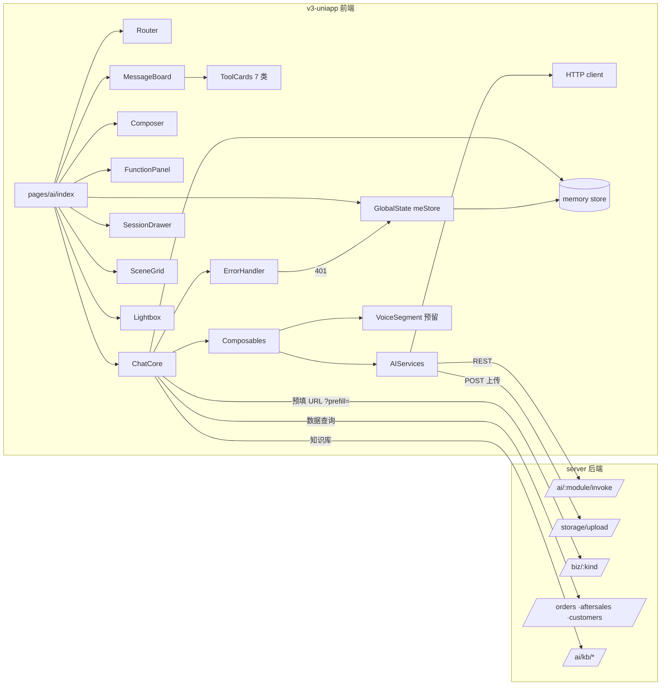
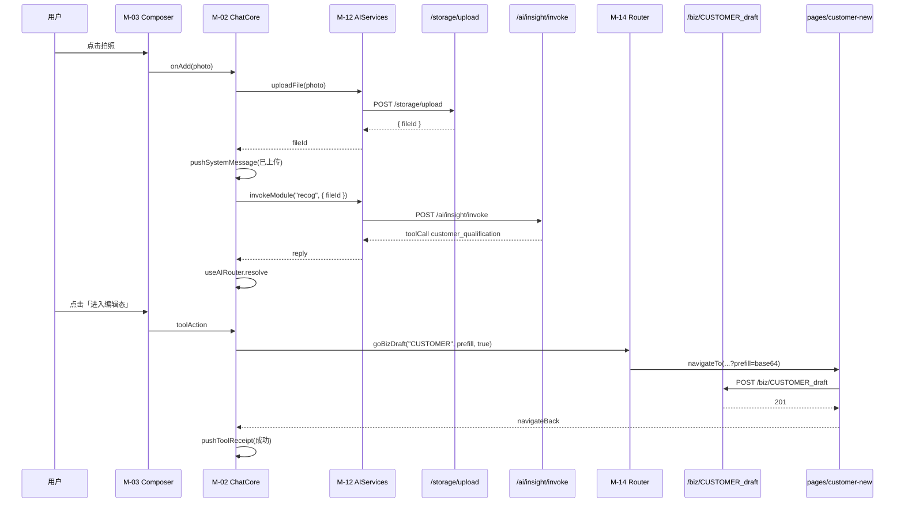
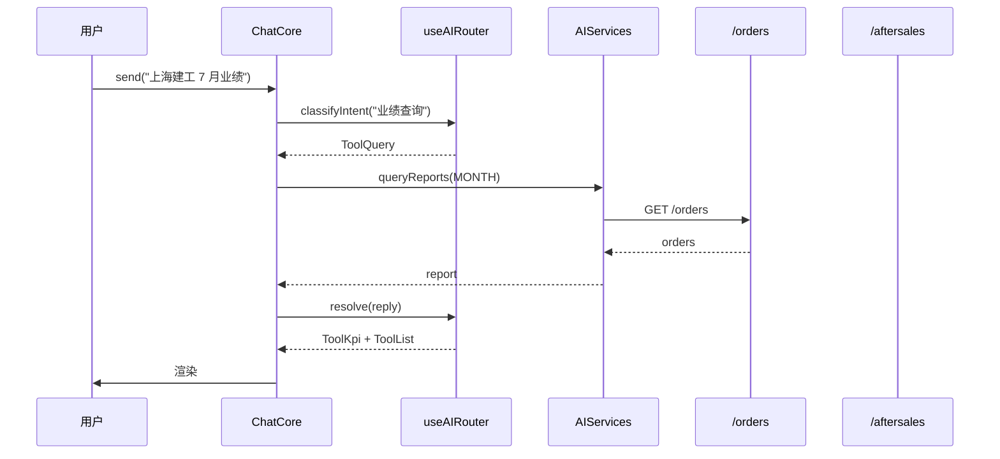
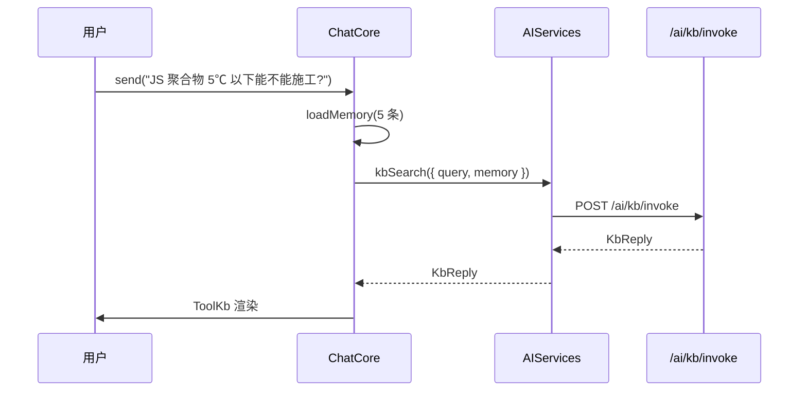
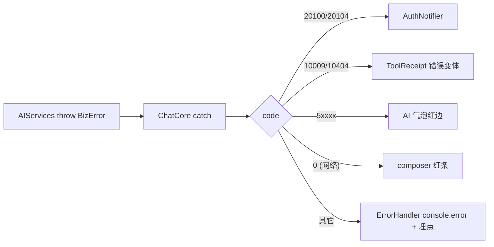

# AI 对话首页 · 功能模块设计 v1.0

> 关联：
> - PRD：`docs/prd/ai-home.md`
> - 设计规格：`docs/design/ai-home.md`
> - API 契约：`docs/API.md`
> - 工程：`v3-uniapp/`（前端） + `server/`（后端）

---

## 0 · 范围与目标

把 `AI 对话首页 v3` 拆分为**独立可实现、可单测、可替换**的模块。每个模块回答：
1. 这个模块做什么？（职责）
2. 它对外暴露什么？（接口 / props / API）
3. 它持有 / 读取 / 写入什么数据？（数据归属）
4. 它坏了影响谁？（失败模式）
5. 如何验证它工作？（单元 / 集成测试点）

不再重复 PRD 的业务目标和设计文档的视觉细节。

---

## 1 · 模块总览

### 1.1 模块关系图



### 1.2 模块清单

| id | 类型 | 名称 | 行号 |
| --- | --- | --- | --- |
| M-01 | 页面 | pages/ai/index | :74 |
| M-02 | 核心 | ChatCore | :88 |
| M-03 | 组件 | Composer | :106 |
| M-04 | 组件 | FunctionPanel | :124 |
| M-05 | 组件 | MessageBoard | :142 |
| M-06 | 组件 | ToolCards（7 个子类） | :160 |
| M-07 | 组件 | SceneGrid | :186 |
| M-08 | 组件 | SessionDrawer | :202 |
| M-09 | 组件 | Lightbox | :218 |
| M-10 | 组合式 | useChat | :234 |
| M-11 | 组合式 | useAIRouter | :252 |
| M-12 | 服务 | AIServices | :270 |
| M-13 | 基础设施 | ErrorHandler | :290 |
| M-14 | 基础设施 | Router（业务路由桥） | :308 |

后端沿用模块（不动结构）：`ai` `biz` `storage` `orders` `aftersales` `customers` `kb`。

---

## 2 · 共享横切（所有前端模块都依赖）

### 2.1 数据契约

所有模块共享 TypeScript 接口（与 `docs/design/ai-home.md` §11 一致）：

- `ChatMessage { id, role, contents, attachments?, toolCalls?, at }`
- `Role = "user" | "assistant" | "system"`
- `MsgContent = { kind:"text", text } | { kind:"image", fileId, url? } | { kind:"file", fileId, name, mime }`
- `ToolCall { id, type, args, preview }`

阶段一全部手写类型；阶段二建议引入 zod。

### 2.2 鉴权与 traceId

- 复用 `v3-uniapp/src/api/client.ts` 中的 token / refresh / traceparent。
- 不允许前端模块自行构造 header。
- 401 命中由 `setAuthNotifier` 触发 reLaunch 到登录页（已有）。

### 2.3 错误信封

所有 AI 调用失败统一抛 `BizError`，由 `ErrorHandler` 统一呈现。

| BizError code | 表现 |
| --- | --- |
| 10009 | 工具卡显示「版本不一致 · 刷新」 |
| 10404 | 工具卡显示「资源不存在 · 重新发起」 |
| 20100 / 20104 | 由 `setAuthNotifier` 接管，跳登录 |
| 5xxxx | AI 气泡红边显示 server msg |
| 0（网络） | composer 上方红条 |

### 2.4 路由约定

- 业务跳转 URL 加 `?prefill=<base64>`；目标页 `onLoad(options)` 解码。
- 进入既有 `pages/*-new/*` 后，返回键回到对话页栈。
- `uni.switchTab` 仅用于 tabBar 间跳转。

---
## 3 · M-01 pages/ai/index.vue（页面壳）

### 3.1 职责

- 路由 `/pages/ai/index` 唯一入口。
- 组合所有子模块（M-03 ~ M-09）到屏幕布局中（notch / titlebar / body / composer / footer）。
- 注册全局异常：401 → reLaunch 登录页。
- 触发埋点：`page_view { page:"/pages/ai" }`。

### 3.2 接口

```ts
defineExpose({});
// 父组件：tabBar 自身；子组件：M-02 ~ M-09
```

### 3.3 数据归属

- 不持业务数据；只持 `messages: Ref<ChatMessage[]>`（代理自 `useChat`）。
- 不缓存网络请求。

### 3.4 失败模式

| 场景 | 表现 |
| --- | --- |
| ChatCore 抛错 | 顶层错误边（沿 `global.scss`） |
| 子组件 mount 失败 | 整页降级为空欢迎卡 + 重试按钮 |

### 3.5 测试点

- 单测：`it("renders default state when messages empty")`。
- e2e：`puppeteer` 进入 4 个默认态场景卡，每张截图对得上设计稿。

---

## 4 · M-02 ChatCore（核心调度）

### 4.1 职责

- 维护内存会话状态（消息、附件、当前请求、计时）。
- 接收 Composer 发出的"发送意图"，组装请求 → AIServices → 拆 reply → 路由到 ToolCards → 渲染。
- 处理取消、错误重试、追发、引用 AI 答复 / 重生成。

### 4.2 接口（exposed）

```ts
interface ChatCoreApi {
  messages: ComputedRef<ChatMessage[]>;
  composerState: Ref<ComposerState>;        // S0..S5
  send(text: string, attachments?: Attachment[]): Promise<void>;
  cancel(): void;
  retry(messageId: string): Promise<void>;
  regen(messageId: string): Promise<void>;
  bindToolAction(toolCallId: string, action: ToolAction): Promise<void>;
}
```

### 4.3 数据归属

- 写入：`messages`、`composerState`、`pendingAttachments`。
- 读取：历史消息、上次附件。

### 4.4 失败模式

| 场景 | 处理 |
| --- | --- |
| send 网络断开 | composerState 跳 S5；本地消息保留为「待发」状态 |
| AI 返回结构损坏 | useAIRouter 兜底渲染「未知回复 · 复制原文」 |
| tool_call 路由缺失 | log 一条 Sentry / console.error；渲染空 tool 占位 |
| 取消 | if (reqController) reqController.abort() |

### 4.5 测试点

- 单测：`send → success` 流程；`send → network fail` 流程；`cancel` 流程。
- 集成：`mock AIServices` 注入失败响应。

---

## 5 · M-03 Composer（输入栏）

### 5.1 职责

- 渲染 §2 6 态机（S0-S5）。
- 暴露输入事件：`onSend`、`onAdd`、`onFocus`、`onBlur`、`onCancel`、`onRetry`。

### 5.2 接口

```ts
defineProps<{
  state: ComposerState;          // S0..S5
  placeholder: string;
  attachments: Attachment[];
  busyMessage?: string;
  error?: { code: number; msg: string };
}>();
defineEmits<{
  (e:"send", payload: { text: string; attachmentIds: string[] }): void;
  (e:"add"): void;
  (e:"cancel"): void;
  (e:"retry"): void;
  (e:"attach-remove", fileId: string): void;
}>();
```

### 5.3 数据归属

- 仅持 UI 临时数据：`text: string`、`hasFocus: boolean`。
- 不持后端调用结果。

### 5.4 失败模式

| 场景 | 表现 |
| --- | --- |
| 输入超长（>2000 字符） | 提交按钮禁用；显示字数提示 |
| 附件超 3 个 | 添加按钮禁用 |
| 输入态被权限拦截 | composer 显示「当前不可用」并降级到不可发 |

### 5.5 测试点

- 单元：6 态机切换的状态转换测试。
- 可访问性：键盘焦点顺序正确（`a11y-skill` 检查）。

---

## 6 · M-04 FunctionPanel（功能面板）

### 6.1 职责

- 渲染 §3 8 个按钮，2 行 4 列。
- 单按钮触发对应行为（拍照 / 上传 / 模板 / 附件 / 快捷意图）。

### 6.2 接口

```ts
defineProps<{
  show: boolean;                // 受 pages 控制
}>();
defineEmits<{
  (e:"trigger", id: FuncId): void;
}>();
```

### 6.3 数据归属

- 仅持 UI 状态，无业务数据。

### 6.4 失败模式

| 场景 | 处理 |
| --- | --- |
| 系统拒绝授权（拍照权限被拒） | toast 提示前往设置 |
| 模板列表加载失败 | 渲染「加载失败 · 重试」按钮 |

### 6.5 测试点

- 单测：8 个按钮 `trigger` 事件正确派发。
- e2e：H5 + 小程序两端拍照入口可用。

---
## 7 · M-05 MessageBoard（消息流）

### 7.1 职责

- 渲染 ChatMessage 数组。
- 按 `at` 倒序，新消息自动滚到底部。
- 区分 4 类气泡（用户 / AI / 系统 / 流式占位）。
- 顶部「会话已重置」全屏 banner（仅在 messages.length === 0 且 refreshKey 重置时显示）。

### 7.2 接口

```ts
defineProps<{
  messages: ChatMessage[];
  busyFrom?: string;            // 流式期间显示「● ● ●」
}>();
defineEmits<{ (e:"bubble-action", payload: { id: string; action: BubbleAction }): void }>();
```

### 7.3 数据归属

- 不写，仅读 ChatCore 暴露的 `messages`。

### 7.4 失败模式

| 场景 | 处理 |
| --- | --- |
| 单条消息过大（>50KB） | 折叠 + 「展开全文」按钮 |
| 流式卡住 | 600ms 未更新切回非流式 |
| 重复内容 | 同 session 同文本自动合并 + 「…」 |

### 7.5 测试点

- 单测：4 类气泡组件按 type 分发。
- e2e：追加 100 条消息仍能 60fps 滚动。

---

## 8 · M-06 ToolCards（7 个子类）

### 8.1 职责

- 每种 `ToolCall.type` 对应一个渲染组件：
  - `ToolRecog`（识别结果）
  - `ToolDraft`（客商草稿）
  - `ToolKpi`（KPI）
  - `ToolList`（列表）
  - `ToolKb`（出处 + 相似案例）
  - `ToolReceipt`（提交回执）
  - `ToolBizSubmit`（业务提交）
- 共用 `.tool-card` 样式，区分 tone（accent / warn / ok / blue）。

### 8.2 接口

```ts
// 通用
defineProps<{ call: ToolCall; readOnly?: boolean }>();
defineEmits<{ (e:"action", payload: ToolAction): void }>();

// 特殊：ToolRecog 接收识别数据
defineProps<{
  call: RecognitionToolCall;
}>();

// 特殊：ToolKb 接收引用数组
defineProps<{
  call: KbReply;
}>();
```

### 8.3 数据归属

- 不写后端。
- 表单提交走 `useAIRouter → Router → uni.navigateTo`。

### 8.4 失败模式

| 类型 | 故障 |
| --- | --- |
| ToolRecog | 字段全部 null → 显示「本次识别失败，再来一张」 |
| ToolDraft | prefill 缺失必要字段 → 按钮禁用 |
| ToolKpi | 数字格式失败 → 用 `formatCents` |
| ToolList | 单行字段缺失 → 显示「—」 |
| ToolKb | 出处文本超长 → 折叠 |
| ToolReceipt | 业务码 10009 → 「版本不一致」 |
| ToolBizSubmit | 401 → AuthNotifier |

### 8.5 测试点

- 每个子类一份快照测试。
- 集成：和 AIServices mock 配合，传入 7 种 type，每种截图。

---

## 9 · M-07 SceneGrid（默认态场景卡）

### 9.1 职责

- 在 messages.length === 0 时渲染欢迎卡 + 6 张场景卡。
- 点击场景卡触发对应快捷指令（预填 + focus）。

### 9.2 接口

```ts
defineProps<{
  scenes: SceneCard[];
}>();
defineEmits<{ (e:"pick", scene: SceneCard): void }>();
```

### 9.3 数据归属

- 仅持输入场景列表，从静态常量读。

### 9.4 失败模式

| 场景 | 表现 |
| --- | --- |
| scenes 为空 | 隐藏欢迎卡，回退到「你今天想做什么？」输入栏 |

### 9.5 测试点

- 截图：3 个 viewport 下场景卡正确折叠 / 滚动。

---

## 10 · M-08 SessionDrawer（会话抽屉）

### 10.1 职责

- 渲染抽屉 UI + 分组数据。
- 阶段一只读 useChat 内存。
- 长按菜单：重命名 / 固定 / 删除 / 清空全部。

### 10.2 接口

```ts
defineProps<{ show: boolean; sessions: SessionMeta[] }>();
defineEmits<{
  (e:"close"): void;
  (e:"new"): void;
  (e:"open", id: string): void;
  (e:"pin", id: string): void;
  (e:"delete", id: string): void;
}>();
```

### 10.3 数据归属

- 阶段一仅展示；写操作（重命名 / 固定 / 删除）通过 `useChat` 写入 `localStorage`。

### 10.4 失败模式

| 场景 | 表现 |
| --- | --- |
| 抽屉内点击外部 | 默认不关闭（要显式 ×） |
| 写 localStorage 失败 | toast「本地存储不可用」 |

### 10.5 测试点

- 单测：抽屉开关。
- e2e：长按出菜单；固定 / 取消固定后图标变化。

---

## 11 · M-09 Lightbox（场景卡浮层）

### 11.1 职责

- 居中展示一张场景示意图，附描述 + 关键点 + CTA。

### 11.2 接口

```ts
defineProps<{ scene: SceneCard; open: boolean }>();
defineEmits<{ (e:"close"): void }>();
```

### 11.3 数据归属

- 无写操作。

### 11.4 失败模式

| 场景 | 表现 |
| --- | --- |
| 图片 404 | 占位骨架 |
| 移动端硬件返回键 | 关闭浮层 |

### 11.5 测试点

- e2e：键盘 ESC / × / 点击外部三种关闭方式。
## 12 · M-10 useChat（组合式）

### 12.1 职责

- 内存维护消息列表（最近 ≤ 100 条）。
- 提供 `send` / `cancel` / `retry` / `regen` / 4 个动作。
- `memory.ts` 持久化到 `uni.setStorageSync("xzb_chat_memory")`。

### 12.2 接口

```ts
interface UseChatReturn {
  messages: Ref<ChatMessage[]>;
  composerState: Ref<ComposerState>;
  send(text: string, attachments?: Attachment[]): Promise<void>;
  cancel(): void;
  retry(messageId: string): Promise<void>;
  regen(messageId: string): Promise<void>;
  pushSystemMessage(text: string): void;
  reset(): void;
  sessions: ComputedRef<SessionMeta[]>;
  pinSession(id: string): void;
  deleteSession(id: string): void;
}
```

### 12.3 数据归属

- 唯一拥有消息 + 会话内存；其它模块只读不写。

### 12.4 失败模式

| 场景 | 处理 |
| --- | --- |
| 内存超 100 条 | 弹出最旧 1 条，保留最近 100 |
| 写入 storage 异常 | 仅 console.warn；不影响 UI |
| 多 tab 打开同一小程序 | 各 tab 独立 store，不同步（阶段一约束） |

### 12.5 测试点

- 单测：消息上限替换；session pin / unpin；reset 清空。

---

## 13 · M-11 useAIRouter（组合式）

### 13.1 职责

- 把 AI reply 解析为 Vue 组件树（消息列表 + toolCalls 路由到对应组件）。
- 规范化：缺失字段兜底；非法 type 路由到通用 `ToolUnknown`。

### 13.2 接口

```ts
interface UseAIRouterReturn {
  resolve(message: ChatMessage): RenderPlan;
  prefillFor(type: ToolType, payload: unknown): Record<string, unknown>;
}

interface RenderPlan {
  bubble: 'user' | 'ai' | 'system' | 'streaming';
  components: Array<{
    component: 'ToolRecog' | 'ToolDraft' | 'ToolKpi' | 'ToolList' | 'ToolKb' | 'ToolReceipt' | 'ToolBizSubmit' | 'Unknown';
    props: Record<string, unknown>;
  }>;
}
```

### 13.3 数据归属

- 不持业务数据。

### 13.4 失败模式

| 场景 | 处理 |
| --- | --- |
| 缺字段 | 默认 `—` 占位 |
| 未知 type | log 后渲染 fallback |
| 嵌套结构超出 3 层 | 截断 + 「…」 |

### 13.5 测试点

- 单元：7 种 type 的样例 → 期望渲染组件名。
- 兜底：随机坏数据下不抛。

---

## 14 · M-12 AIServices（服务层）

### 14.1 职责

- 封装与后端的网络交互：AI 单回合调用、上传附件、查询业务。
- 不持 UI 状态；只提供 Promise。
- 全部走 `request<T>()`（v3-uniapp/src/api/client.ts）走 envelope 与拦截。

### 14.2 接口

```ts
interface AIServices {
  invokeModule(module: AiModule, prompt: string, ctx: Record<string, unknown>): Promise<Envelope<AiInvokeResult>>;
  uploadFile(file: Blob, onProgress?: (p: number) => void): Promise<Envelope<{ fileId: string; url: string }>>;
  queryOrders(customerId?: string, filter?: OrderFilter): Promise<Envelope<PageResult<OrderRow>>>;
  queryAftersales(filter?: AftersaleFilter): Promise<Envelope<PageResult<AftersaleRow>>>;
  queryReports(period: 'WEEK' | 'MONTH' | 'QUARTER' | 'YEAR'): Promise<Envelope<MeReports>>;
  kbSearch(query: string): Promise<Envelope<KbReply>>;
  bizSubmit(kind: BizKind, payload: unknown): Promise<Envelope<BizResult>>;
}
```

### 14.3 数据归属

- 不缓存；请求结果交给调用方持有。

### 14.4 失败模式

| 场景 | 处理 |
| --- | --- |
| 上传超时 | 重试 1 次；第二次失败抛 BizError(code=0, "上传超时") |
| AI 调用超过 8s | 客户端 abort；抛 code=0 |
| 多并发 | 由 `request()` 的 refresh 单飞锁保护 |

### 14.5 测试点

- 单元：用 `fetch` mock 替换逐个接口。
- 集成：和 useChat 一起跑端到端测试。

---

## 15 · M-13 ErrorHandler（基础设施）

### 15.1 职责

- 全局捕获 BizError，路由到合适表现（composer 红条 / AI 气泡红边 / 系统 toast）。
- 集中埋点上报。
- 401 → AuthNotifier reLaunch 登录页。

### 15.2 接口

```ts
const errorHandler = {
  handle(err: BizError, ctx: ErrorContext): void;
  attachGlobal(): void;        // 注册 onError/onUnhandleRejection
};
```

### 15.3 数据归属

- 仅持有最近 10 条错误的 ring buffer（埋点冗余）。

### 15.4 失败模式

| 场景 | 处理 |
| --- | --- |
| BizError 嵌套多层 | 取出 code 与 msg |
| 重复错误 | 5s 内合并；显示「× N 次」 |
| 自定义错误（非 BizError） | 上报 + console.error |

### 15.5 测试点

- 单元：每种 code 命中正确表现。
- 集成：错误冒泡到全局。

---

## 16 · M-14 Router（业务路由桥）

### 16.1 职责

- 维护 `kind` → `pages/X-new/index` 的映射表（静态）。
- 负责把 prefill payload 编码到 URL 参数（base64 + zlib 可选）。
- 处理跳转拦截（写操作要求前置 modal）。

### 16.2 接口

```ts
interface Router {
  goBizDraft(kind: BizKind, prefill: Record<string, unknown>, requireConfirm?: boolean): Promise<void>;
  goBizDetail(no: string): Promise<void>;
  goCustomerDetail(bp: string): Promise<void>;
  goKbDoc(docId: string, section?: string): Promise<void>;
  getPathByKind(kind: BizKind): string;     // 测试用
}
```

### 16.3 数据归属

- 仅持静态映射表与 prefill 编码函数。

### 16.4 失败模式

| 场景 | 处理 |
| --- | --- |
| kind 未知 | console.error；不跳 |
| prefill 超长（>2KB） | 拆分到 storage，URL 仅存 key |
| 用户拒绝 modal | 不跳 |

### 16.5 测试点

- 单元：每种 kind 路由正确。
- 集成：写操作必须命中 modal。

---
## 17 · 跨模块典型交互序列

### 17.1 拍照 → 草稿提交流



### 17.2 数据查询流



### 17.3 知识库问答流



### 17.4 错误冒泡



---

## 18 · 非功能需求矩阵

| 指标 | M-01 | M-02 | M-03 | M-04 | M-05 | M-06 | M-07 | M-08 | M-09 | M-10 | M-11 | M-12 | M-13 | M-14 |
| --- | --- | --- | --- | --- | --- | --- | --- | --- | --- | --- | --- | --- | --- | --- |
| P95 渲染 < 16ms | ★ | | | | ★ | ★ | | | | | ★ | | | |
| 内存峰值 < 50MB | | ★ | | | ★ | ★ | | | | ★ | | | | |
| 请求并发 ≤ 3 | | ★ | | | | | | | | | | ★ | | |
| 401 全局拦截 | | | | | | | | | | | | ★ | ★ | |
| 可访问性 | ★ | | ★ | ★ | ★ | ★ | ★ | ★ | ★ | | | | |
| 国际化 | ★ | | ★ | | ★ | | | | | | | | |
| 离线降级 | | | ★ | | | | | | | ★ | | ★ | | |

---

## 19 · 测试与可观测

### 19.1 单测覆盖目标

| 模块 | 工具 | 覆盖率目标 |
| --- | --- | --- |
| M-10 useChat | vitest | 90% |
| M-11 useAIRouter | vitest | 95% |
| M-12 AIServices | vitest + fetch mock | 90% |
| M-13 ErrorHandler | vitest | 85% |
| M-14 Router | vitest | 95% |
| M-03 Composer（6 态机） | vitest + happy-dom | 100% |
| M-06 ToolCards | vitest 快照 | 各 80% |

### 19.2 集成 / e2e

| 用例 | 路径 |
| --- | --- |
| 拍照 → 草稿 → 编辑 → 提交 | puppeteer |
| 数据查询 → KPI → 列表 → 详情 | puppeteer |
| 知识库 → 出处 → 原文 | puppeteer |
| 401 重启登录 | puppeteer mock auth |
| 旧 5 tab 全部可用 | puppeteer |

### 19.3 埋点事件

| 事件名 | 模块 | 字段 |
| --- | --- | --- |
| `page_view` | M-01 | page |
| `composer_send` | M-02 | kind, has_attachment, attachment_count |
| `attachment_upload` | M-12 | fileId, mime, size, success |
| `tool_call` | M-11 | type, render_component |
| `biz_submit` | M-14 | kind, success, code |

---

## 20 · 跨团队依赖与变更管理

| 依赖 | Owner | 节奏 | 风险 |
| --- | --- | --- | --- |
| `ai` 模块端点 | 后端 | 沿用，不动 | 低 |
| `storage/upload` | 后端 | 沿用；关注 4MB+ 上传 CORS | 低 |
| `biz/:kind` 写操作 | 后端 | 沿用 | 中（前置 modal） |
| 设计 token | 设计 | 沿用 | 低 |
| v3-uniapp 路由 | 前端（v3-uniapp） | 沿用 | 低 |

API 变更需走 PR 流程：任何对 envelope 或 endpoint 的修改要先过本 PRD Reviewer。

---

## 21 · 模块设计开放问题

| id | 问题 | 候选 | Owner |
| --- | --- | --- | --- |
| MQ-1 | AI 回复内 tool_call 顺序允不允许并行 | 串行 / 部分并行 | 后端 |
| MQ-2 | 附件 base64 直传还是 multipart | multipart | 后端 |
| MQ-3 | prefill payload 上限 | 2KB / 4KB | 设计 |
| MQ-4 | 阶段一是否暴露 `useAIRouter` 给其它页面用 | 仅 /pages/ai / 全局 | 前端 |
| MQ-5 | 错误埋点上报走 Sentry / 自研 | 自研（轻量） | 前端 |

---

## 22 · 模块决策记录

| id | 决策 | 原因 |
| --- | --- | --- |
| MD-1 | ChatCore 仅持内存 state，DB 留阶段二 | 见设计 §6 + PRD §5 |
| MD-2 | AIServices 不缓存接口响应 | 缓存会与 ETAG 策略冲突，留后端 |
| MD-3 | useAIRouter 不引第三方 zod | 阶段一手写类型足够 |
| MD-4 | Router prefill 不放 memory 而放 URL | URL 参数更便于新开页面和回填 |
| MD-5 | Composer 6 态机集中在组件内，不抽 hook | hook 越少越好 |
| MD-6 | Lightbox 仅用于演示场景，真实流程不再走 | 真实场景直接进业务页 |
| MD-7 | 不依赖客户端长连接 / SSE | H5 兼容麻烦，阶段一同步 |
| MD-8 | 写操作必须前置 modal | 数据安全 |

---

## 23 · 模块拆分 checklist（实施前自检）

- [ ] 每个模块文件 < 300 行（首期）
- [ ] 每个模块可独立编译
- [ ] 每个模块至少 1 份单测
- [ ] 每个模块的 props / emit 完整定义
- [ ] 错误码 100% 走 BizError 抛出
- [ ] 401 全局由 AuthNotifier 收口
- [ ] 不直接访问 `uni.*` 全局变量（除 AIServices / Router）
- [ ] 不直接 fetch HTTP（只走 AIServices）
- [ ] 不在视图层处理业务逻辑（只接收 props + emit 事件）
- [ ] 不出现 hard-coded URL / 端口 / IP

---

## 24 · 后续阶段差异

### 24.1 阶段二增加模块

- M-15 ChatPersistence（DB 持久化，会话历史）
- M-16 SessionSidebar（左侧持久化入口）
- M-17 FollowAssistant（基于待办的主动通知）

### 24.2 阶段三增加模块

- M-18 ConversationFanout（绑业务单的总结）
- M-19 ReportExport（向 Refine 报表导出 AI 用量）

---

## 25 · 关联文档清单

| 文档 | 路径 |
| --- | --- |
| PRD | `docs/prd/ai-home.md` |
| 设计规格 | `docs/design/ai-home.md` |
| 模块设计（本文件） | `docs/modules/ai-home.md` |
| API 契约 | `docs/API.md` |
| 后端工程 | `server/` |
| 前端工程 | `v3-uniapp/` |