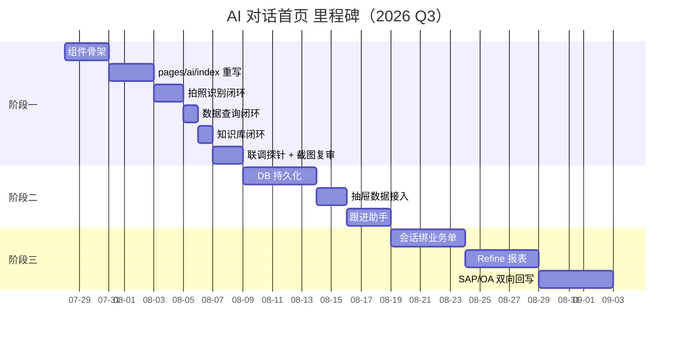

# AI 对话首页 PRD · v1.0

> 关联：
> - 设计规格：`docs/design/ai-home.md`
> - 后端契约：`docs/API.md`
> - 前端工程：`v3-uniapp/`
> - 当前版本目标：`v3-uniapp` midButton 升级 + `server v3` 浅接入。

---

## 0 · 文档元信息

| 项 | 值 |
| --- | --- |
| 版本 | v1.0 |
| 起草 | 2026-07-25 |
| 状态 | 待评审 |
| Owner | Frontend（v3-uniapp） / Backend（server v3，提供 `/ai/:module/invoke` + `/storage/upload` 已就绪） |
| 关联 PR | （待 first 阶段落地后补） |

---

## 1 · 背景与机会窗口

### 1.1 现状

- 销售员每天 70% 的动作是「建档 / 查业绩 / 补资质 / 过审批 / 查跟进」，对应 8 张表单 + 多次跳转（详见 `docs/design/ai-home.md:0`）。
- 现状 midButton 文案「AI」指向 `/pages/ai`，但页面只是 6 个模块的静态入口，没有任何对话流。
- 多模态识别、知识库问答、文档上传三项业务事实成立，但**没有 UI 承载**。

### 1.2 机会

- 销售外勤场景下，单次操作成本高：一次跳转算 1 次离开主工作流。
- 同行（YonBIP / 纷享销客 / 销售易）已经把「AI 中心」列进 2026 Roadmap。销卓宝若不上，进入下半年卖单会被对标。

### 1.3 不做的事（本 PRD 范围外）

- AI 模型厂商选型（沿用既有 `module=insight/quote/risk/after/kb/follow`）。
- 视频通话 / 语音实时对话（暂缓）。
- 多智能体协作（暂缓，至少不在本年内）。
- 后台（Refine）AI 报表：挪到下一份 PRD。

---

## 2 · 目标与成功指标

### 2.1 北极星

把销售单次「建档 + 补资料 + 提交审批」的总操作时长从 **8 分钟降到 ≤ 2 分钟**。

### 2.2 过程指标（阶段一上线后 30 天）

| 指标 | 目标 | 测量方式 |
| --- | --- | --- |
| AI 首页 DAU 占比 | ≥ 60% 销售员每日进 ≥ 1 次 | `event: page_view { page=/pages/ai }` |
| 拍照建客户闭环转化率 | ≥ 50% 进入对话 → 提交审批 | funnel: enter / image_uploaded / submitted |
| 知识库问答命中率 | ≥ 30% 出处卡被点击「查看原文」 | `event: action_click { source=kb_citation }` |
| 多模态识别成功率 | ≥ 85% 完成客户营业执照建档 | `event: action { kind=customer_qualification, status=success }` |

### 2.3 体验指标

| 指标 | 目标 |
| --- | --- |
| P95 端到端识别闭环耗时 | ≤ 6s（拍照到返回草稿） |
| Composer 输入→首次字节 | ≤ 200ms（本地） |
| 错误面占屏时长 | ≤ 3s 后自动消失 |

---

## 3 · 用户与角色

| 角色 | 占比 | 关键诉求 |
| --- | --- | --- |
| 一线销售员 | 70% | 拍照建档快、查找业绩快、提交审批快 |
| 区域经理 | 15% | 批量审批、AI 摘要日报 |
| 财务 / 客服 | 10% | 看 OA、查退单、查合同条款 |
| 管理员 | 5% | AI 用量 / 命中率 / 安全审计 |

阶段一只服务一线销售员的最高频 5 个动作；其它角色在阶段二/三扩展。

---

## 4 · 用户故事（阶段一）

| id | 故事 | 验收 |
| --- | --- | --- |
| US-1 | 作为销售员，我希望拍照上传营业执照，让 AI 直接建客户草稿，省去逐个输入字段。 | 拍照 → 5s 内出现识别结果卡；点击「进入编辑态」跳转既有表单，缺字段高亮；提交后看到回执卡。 |
| US-2 | 作为销售员，我希望用一句话「上海建工 7 月业绩」找到业绩摘要。 | 输入后 ≤2s 出现 KPI 卡 + 列表气泡；点击详情跳既有订单页。 |
| US-3 | 作为销售员，我想问「JS 聚合物 5℃ 能不能施工」，得到带出处的答复。 | 答复包含 2-3 行短答 + ≥ 1 张出处卡 + 1-3 条相似案例；出处可点跳原文。 |
| US-4 | 作为销售员，我希望在没有 AI 的旧动作上也能继续用。 | 旧 5 tab 全部保留；工作台 / 订单 / 资讯链接正常工作。 |
| US-5 | 作为销售员，我希望模型 / 网络错误时，给我明确的提示而不是空白页。 | 错误态 4 类齐全，错误条自动消失最长 3s。 |
| US-6 | 作为销售员，我希望附件错误时不阻塞整条对话。 | 单附件上传失败仅该 chip 红色，其他仍可发送。 |
| US-7 | 作为销售员，我希望从对话跳到表单页后，回来仍能看到之前消息。 | `uni.navigateBack` 保留对话页栈。 |

阶段二/三用户故事暂不在本 PRD 范围。

---

## 5 · 功能范围

### 5.1 In-scope（阶段一）

1. AI 对话首页（midButton 跳入），覆盖以下 4 个场景：
   - 自然语言文字对话（默认）。
   - 拍照 / 上传图片触发多模态识别。
   - 上传 PDF / 文档触发知识库检索（仅 PDF、≤ 8MB）。
   - 「查业绩」/「建客户」/「问流程」/「搜文档」4 条快捷指令。
2. 工具卡：识别结果、客商草稿、KPI、列表、引用、相似案例、提交回执 7 类。
3. Composer 6 个态机 + 功能面板 8 按钮 + 附件上传（基础）。
4. 与既有 `pages/*-new/*` 表单的桥接（prefill URL 参数）。
5. 错误态集合（网络 / 401 / 403 / 5xx / 附件 / 业务）。
6. 兼容旧动作：tabBar 其余 4 项保持可用，FAB 浮按钮可继续弹出 AI 模块入口。

### 5.2 Out-of-scope（阶段一明确不做）

- DB 持久化对话；阶段一只做进程内 memory（最近 5 条）。
- 会话抽屉的真实数据；阶段一仅 UI 框架，操作限于本地 store。
- 群组 / 团队 / 共享会话。
- 语音实时对话 / 视频通话 / 与第三方 IM 集成。
- 后台 Refine 端 AI 报表。
- 自定义指令 / Agent 编排。
- 持续微调 / 评测。

### 5.3 阶段二（v3.x）

| 项 | 业务价值 |
| --- | --- |
| DB 持久化会话 + 抽屉数据可点开 | 找回会话的能力从 0 → 真实 |
| 跟进助手内嵌对话 | 客户待办 AI 主动推送 |
| 群组会话 | 区域经理协同 |

### 5.4 阶段三（v4.x）

- 会话绑业务单（同一客户聚合所有对话）。
- 群组总结。
- 后台 Refine AI 报表。
- 与 SAP / OA 双向回写。

---

## 6 · 优先级与里程碑

### 6.1 里程碑总览

### 6.2 阶段一详细排期

| 工作日 | 内容 | Exit criteria |
| --- | --- | --- |
| D1 | 13 个组件骨架 + `useChat` + `useAIRouter` | 单元编译通过 |
| D2 | `pages/ai/index.vue` 重写 + 6 张场景卡 | 默认态截图 |
| D3 | Composer 6 态机 + 功能面板 + 附件 chip | 6 状态可达 |
| D4 | 多模态识别闭环：拍照 → OCR → 工具卡 → 进表单 | US-1 通过 |
| D5 | 数据查询闭环：调用 `/orders` `/aftersales` `/me/reports` | US-2 通过 |
| D6 | 知识库闭环：复用 `/ai/kb/invoke`，UI 出处卡 | US-3 通过 |
| D7 | 错误态 + 动效 + 验收清单 | 全部 US 通过，puppeteer 0 报错 |

> 详细技术拆分见 `docs/design/ai-home.md:15`。

---

## 7 · 跨模块依赖

| 依赖项 | 影响 | 现状 | 后续 |
| --- | --- | --- | --- |
| `POST /storage/upload` | 拍照 / 上传核心 | 已就绪 | 关注 CORS 与限流 |
| `POST /ai/:module/invoke` | 单回合 AI 调用 | 已就绪 | 阶段一直接复用 |
| `POST /biz/:kind` | AI 提交表单跳既有页面后真实写入 | 已就绪 | 关注 10008 / 10009 错误码 |
| `GET /orders`、`/aftersales`、`/customers`、`/products` | 数据查询 | 已就绪 | 关注大表分页（默认 size=20） |
| `GET /dicts` | 状态 / 行业 / 银行枚举 | 已就绪 | 阶段一暂不需 |
| `POST /aftersales/:id/status` 等状态机 | 工具卡片「回执」高频 | 已就绪 | 阶段一做只读 |
| 微信小程序 / H5 互通 | 一套代码两端 | 已就绪 | 阶段一重点验证 H5 |
| 推送 / 通知 | AI 提交后推送 | 待办 | 阶段二做 |

---

## 8 · 风险与开放问题

### 8.1 风险表

| 风险 | 概率 | 影响 | 缓解 |
| --- | --- | --- | --- |
| 后端 AI mock 在大数据下响应过慢 | 高 | 高 | 阶段一走「问 → 答」同步链，避免 streaming；加客户端超时 8s |
| 小程序端上传大小限制 | 中 | 中 | 阶段一走 `storage/upload`，前端压缩到 1080 长边 |
| midButton 改名影响老用户 | 中 | 低 | 「AI」过渡期内兼任软链：在「AI」标题下面加一行「对话」副标题 |
| AI 返回结构不稳定 | 高 | 中 | 由 `useAIRouter` 统一规范化；类型与 zod schema 对齐 |
| 会话数据隐私 | 中 | 高 | 上传前去除 EXIF；附件加密（沿用现有 S3 机制）；审计日志阶段二补 |
| 阶段一不做持久化，杀进程即丢 | 高 | 中 | 顶部明确提示「本会话仅本次有效」；阶段二直接接 DB |

### 8.2 开放问题（待用户拍板）

| id | 问题 | 候选 |
| --- | --- | --- |
| Q1 | midButton 文案 | 「对话」 / 保留「AI」 |
| Q2 | 默认态场景卡条目 | 见 `docs/design/ai-home.md:1.3` |
| Q3 | 阶段一是否做抽屉 UI 占位 | 做（仅 UI）/ 不做 |
| Q4 | 工具卡「提交审批」是否前置 modal | 是 / 否 |
| Q5 | 同名会话是否合并显示 | 是 / 否（影响抽屉结构） |

---

## 9 · 验收与观测

### 9.1 阶段一验收

- 功能验收：本文 §4 列 7 个 US 全部通过。
- 设计验收：`docs/design/ai-home.md:16` 的 10 条清单逐条对齐。
- 体验验收：
  - 5 个真实业务场景的 Puppeteer 截图 + 视频记录。
  - 任一场景下 console error = 0。
- 性能验收：移动 4G 网络下截图全流程 ≤ 6s。

### 9.2 上线观测

- 关键事件：`page_view`、`composer_send`、`attachment_upload`、`tool_call`、`biz_submit`。
- 关键漏斗：默认态 → 发送消息 → 工具卡 → 业务提交（按天聚合）。
- 异常监控：4xx / 5xx 错误占比；附件上传失败率；会话 P95 响应时间。
- 客诉通道：阶段一不开放客服接收；钉钉群日报。

### 9.3 发布策略

| 阶段 | 用户 |
| --- | --- |
| 灰度 | 销售部一线销售员 10%（内部可见） |
| 全量 | 公司全员，逐步打开至外勤版 |

发布开关：后端 `feature.AI_HOME_ENABLED` 默认 false；前端读 `meStore` 中 flag；不存在该 flag 时回退到原 6 模块 AI 工作台。

---

## 10 · 附录

### 10.1 决策记录

| id | 决策 | 原因 |
| --- | --- | --- |
| D-1 | 阶段一不做 DB 持久化对话 | 见 `docs/design/ai-home.md:13` 轻量 memory 替代 |
| D-2 | AI 提交审批必须前置 modal | 写操作不允许一步到位 |
| D-3 | midButton 文案改「对话」 | 与大模型厂商心智对齐 |
| D-4 | 不引入新色板 | 沿用 `v3-uniapp/src/uni.scss` |
| D-5 | 多模态走 `/storage/upload` 而非 multipart | 与已有上传链路保持一致 |

### 10.2 评审清单

- [ ] 产品评审：US 完整性
- [ ] 设计评审：对照 `docs/design/ai-home.md`
- [ ] 前端评审：组件拆分合理性
- [ ] 后端评审：是否需要新增端点（本阶段：否）
- [ ] 数据评审：事件埋点是否齐全
- [ ] 安全评审：附件 / 内容合规

---

## 11 · 签批

| 角色 | 姓名 | 日期 | 状态 |
| --- | --- | --- | --- |
| 产品 |  |  | 待签 |
| 设计 |  |  | 待签 |
| 前端 |  |  | 待签 |
| 后端 |  |  | 待签 |
| 测试 |  |  | 待签 |

> 本 PRD 进入正式开发前需完成 §8.2 开放问题 Q1-Q5 拍板。